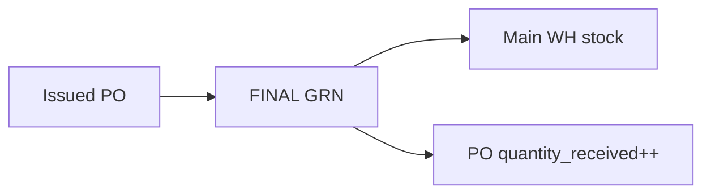
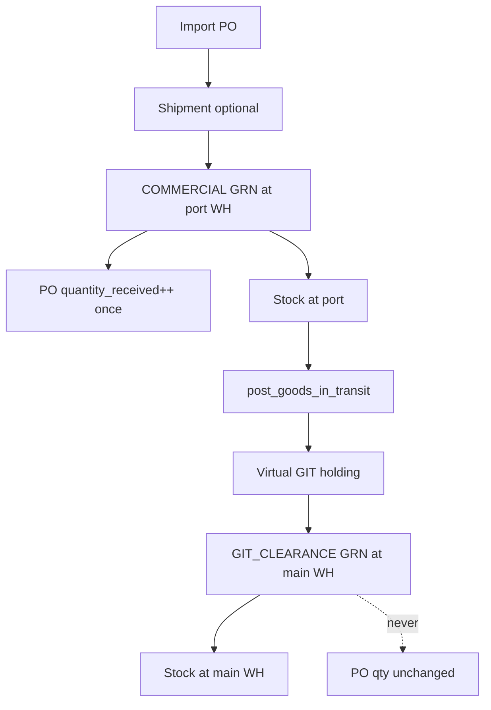

# Import Logistics & Goods-in-Transit

**Read this first** when working on overseas import receipts, staging warehouses, goods-in-transit (GIT) vouchers, or import shipment choreography.

**Related docs:** [`INVENTORY_OPERATIONS.md`](./INVENTORY_OPERATIONS.md), [`PROCUREMENT_BILLING.md`](./PROCUREMENT_BILLING.md), [`GST_COMPLIANCE.md`](./GST_COMPLIANCE.md), [`AGENT_HANDOVER.md`](./AGENT_HANDOVER.md).

**Last updated:** 2026-08-02 (Phases 0–6 foundation, GL posting, docs/tests).

---

## 1. Design principle

One shared engine, **tenant-composable** via:

1. **Topology** — locations the tenant defines (port WH, virtual GIT node, main WH)
2. **Policy registry** — `IMPORT_LOGISTICS_SETTINGS` in `workspace_control_registry`
3. **Document choreography** — explicit receipt *stages*, not one hard-coded import timeline

**Domestic hub-and-spoke** uses existing **stock transfers** (`/inventory/transfers`), not GIT.

---

## 2. Binding product rules

| Rule | Implementation |
|------|----------------|
| Receipt document shape | Tenant policy `import_receipt_document_strategy` |
| PO `quantity_received` | Increments **only** on PO-fulfilling receipts; **never** on GIT clearance |
| GIT scope | **Import only** (`IMPORT_GOODS` PO/shipment guard in Phase 4 RPCs) |
| Shipments | First-class entity (Phase 2); multi-PO allocation |
| `po_fulfillment_stage` | Tenant default + optional PO override |

---

## 3. Tenant policy (`IMPORT_LOGISTICS_SETTINGS`)

Stored in `workspace_control_registry` (`registry_key = 'IMPORT_LOGISTICS_SETTINGS'`).

| Key | Values | Purpose |
|-----|--------|---------|
| `imports_enabled` | boolean | Master switch — hides import modules/settings when false |
| `import_receipt_document_strategy` | `SINGLE_GRN_WITH_STAGES`, `SEPARATE_GRNS_PER_STAGE`, `SINGLE_FINAL_ONLY` | How many GRN documents per import journey |
| `import_receipt_mode` | `DIRECT_TO_WAREHOUSE`, `STAGING_THEN_GIT`, `STAGING_THEN_TRANSFER` | Staging vs direct path |
| `po_fulfillment_stage` | `COMMERCIAL`, `FINAL` | When PO open qty is consumed |
| `require_boe_on_first_receipt` | `ALWAYS`, `NEVER`, `ON_FINAL_RECEIPT_ONLY` | Bill of Entry gate for `IMPORT_GOODS` |
| `allow_staging_receipt_location_mismatch` | boolean | GRN at staging WH when PO ultimate destination differs |
| `allow_commercial_receipt_before_customs` | boolean | Skip BoE on commercial stage |
| `git_enabled` | boolean | Tenant uses procurement GIT module |

**UI:** Settings → Modules → Procurement → **Policies** tab → enable **We import goods from overseas**. Detailed policies appear on the **Import & logistics** tab when enabled.

**Lib:** `apps/web/lib/procurement/import-logistics-settings.ts`

---

## 4. Receipt stages

`goods_receipts.receipt_stage` enum:

| Stage | PO qty++ | Inventory | BoE |
|-------|----------|-----------|-----|
| `COMMERCIAL` | If PO-fulfilling per settings | + at staging | Optional per policy |
| `CUSTOMS` | No | Cost/duty restate | From shipment → GRN |
| `FINAL` | If PO-fulfilling | + at main WH | Per policy |
| `GIT_CLEARANCE` | **Never** | GIT − / main WH + | N/A |

`goods_receipts.is_po_fulfilling` gates `purchase_order_items.quantity_received` updates.

**Client resolver:** `resolveGrnReceiptContext()` in `apps/web/lib/procurement/import-logistics/receipt-context.ts`.

---

## 5. Typical tenant flows

### 5.1 Direct to warehouse (default)

Matches legacy behaviour when `import_receipt_document_strategy = SINGLE_FINAL_ONLY`.

### 5.2 Staging → GIT → clearance (import)

### 5.3 Staging → stock transfer (domestic)

Use `STAGING_THEN_TRANSFER` policy mode but execute with **inventory transfers**, not GIT.

---

## 6. Locations

| Flag | Type | Role |
|------|------|------|
| `is_git_holding` | Virtual + stock-holding | In-transit GIT node |
| Physical port WH | `is_stock_holding` | Staging receipt location |

**Migration:** `20260802100000_virtual_git_stock_holding.sql` — virtual locations may hold stock when `is_git_holding` or `is_subcontract_wip`.

**UI:** Settings → Locations → Advanced → **GIT holding node**.

---

## 7. GIT vouchers

| RPC | Purpose |
|-----|---------|
| `post_goods_in_transit` | Source WH → GIT holding (inventory ledger) |
| `clear_goods_in_transit_for_grn` | GIT holding − on clearance GRN |
| `cancel_goods_in_transit` | Reverse posted GIT (Phase 4) |
| `post_grn_with_git_clearance` | Atomic clear + GRN (Phase 4) |

**Route:** `/procurement/goods-in-transit`

**Tables:** `goods_in_transit_vouchers`, `goods_in_transit_voucher_items`

---

## 8. Financial / GL (Phase 5)

Configure in Settings → Modules → Procurement → Policies → **Billing GL accounts**:

| Setting key | Account type | Used when |
|-------------|--------------|-----------|
| `git_holding_account_id` | ASSET | GIT post/clear GL |
| `promo_contra_expense_account_id` | EXPENSE | Promo bundle restate |
| `ppv_expense_account_id` | EXPENSE | Purchase price variance |
| `vendor_prepayment_account_id` | LIABILITY | Vendor advances |

When `git_holding_account_id` is set (`FINANCIAL_SETTINGS`):

- **GIT post:** Dr GIT holding / Cr `1400-INVENTORY`
- **GIT clear:** Dr `1400-INVENTORY` / Cr GIT holding

**Migration:** `20260802180000_git_gl_posting.sql` — `private.post_git_inventory_gl`.

Import IGST capitalization still flows through GRN customs stages — see [`GST_COMPLIANCE.md`](./GST_COMPLIANCE.md).

---

## 9. PO routing fields

`purchase_orders` extensions (Phase 1):

- `receipt_location_id` — staging receipt WH
- `ultimate_destination_location_id` — planning destination
- `po_fulfillment_stage_override` — `COMMERCIAL` | `FINAL`

---

## 10. Migration index (CI order)

| Migration | Phase | Summary |
|-----------|-------|---------|
| `20260802100000_virtual_git_stock_holding.sql` | 0 | Virtual GIT stock-holding fix |
| `20260802110000_grn_receipt_stage_foundation.sql` | 0 | GRN stage columns + `is_po_fulfilling` |
| `20260802120000_import_logistics_settings_registry.sql` | 1 | Policy registry helpers |
| `20260802130000_import_shipments.sql` | 2 | Shipment entity (when present) |
| `20260802140000_po_receipt_routing_fields.sql` | 1 | PO receipt routing columns |
| `20260802150000_post_goods_receipt_import_choreography.sql` | 3 | Stage-aware GRN RPC |
| `20260802160000_git_shipment_import_guards.sql` | 4 | Import-only GIT guards |
| `20260802170000_git_clearance_partial_atomic.sql` | 4 | Partial clearance + atomic RPC |
| `20260802180000_git_gl_posting.sql` | 5 | GIT GL posting |

---

## 11. Tests & smoke

| Artifact | Path |
|----------|------|
| Receipt context unit tests | `apps/web/lib/procurement/import-logistics/__tests__/receipt-context.test.ts` |
| Procurement smoke (extended) | `apps/web/scripts/smoke-procurement.mjs` — `SMOKE_EXTENDED=1` includes staging → GIT → clearance PO qty guard |

Run unit tests: `npm test` from `apps/web`.

Run smoke: `SMOKE_EXTENDED=1 node scripts/smoke-procurement.mjs` (requires local dev server + `.env.local`).

---

## 12. Explicit backlog

- Bonded warehouse expiry automation
- Lot/serial on import GRN
- Supplier portal BoE upload
- Sales `/fulfillment/shipping` integration
