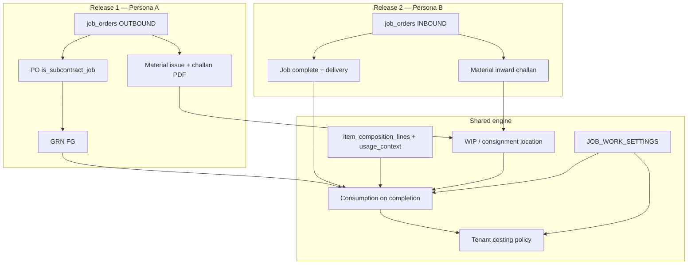

# Job Work & Subcontracting — Implementation Plan

**Status:** Decisions locked — ready for build planning  
**Last updated:** 2026-06-24  
**Audience:** Product, engineering, operations  

**Related docs:** [`INVENTORY_OPERATIONS.md`](./INVENTORY_OPERATIONS.md), [`PROCUREMENT_BILLING.md`](./PROCUREMENT_BILLING.md), [`PO_UX_PLAN.md`](./PO_UX_PLAN.md), [`ITEM_CREATION_V2.md`](./ITEM_CREATION_V2.md) (composition / V2.4 WIP), [`IMPORT_LOGISTICS.md`](./IMPORT_LOGISTICS.md), [`AGENT_HANDOVER.md`](./AGENT_HANDOVER.md).

---

## 1. Purpose

This document is the **single canonical plan** for **job work** in AIB Smart ERP. It covers two tenant personas that share the same underlying problem (process materials into finished goods at an external boundary) but with **inverted document chains**:

| Persona | Role | Direction |
|---------|------|-----------|
| **A — Principal (outbound subcontract)** | You send materials to a vendor; they return finished goods | Procurement-centric |
| **B — Job worker (inbound contract job)** | A customer sends materials to you; you return finished goods | Sales-centric |

Wave 6 shipped **Persona A plumbing only** (`20260612210000_wave6_git_subcontract.sql`, `/procurement/subcontract`). **Persona B is not started.**

**v1 program scope:** Both personas ship within the same v1 program, **sequenced**: Persona A end-to-end first, then Persona B + GST movement challan print.

---

## 2. Locked decision manifest (2026-06-24)

| Area | Decision |
|------|----------|
| **Personas** | Both in v1; **deliver Persona A E2E before Persona B + GST print** |
| **Phase 0 / Release 0** | Proceed |
| **Mixed supplier** | Yes — subcontract/job **only** when explicitly flagged (`is_subcontract_job` / job order link) |
| **BOM (D2)** | **B — Product Composition only** with job-work line metadata (`usage_context`, `supply_source`); migrate off `subcontract_bom_lines` |
| **FG costing (D6)** | **Tenant setting** — default `PROCESSING_PLUS_MATERIAL` |
| **Backflush timing (D4)** | **Tenant setting** — default `AUTO_BY_QC_POLICY` (QC on → on QC release; else on GRN accept) |
| **Insufficient WIP (D7)** | **Tenant setting** — default `BLOCK_RECEIPT` |
| **Material issue (D3)** | **Material issue document** + linked transfer/post to WIP; drop-ship PO to WIP secondary |
| **Order model (D1)** | **`job_orders`** table with `direction` (`OUTBOUND` / `INBOUND`); PO flag bridge in Release 0 only |
| **Persona B v1** | Yes |
| **GST (D15)** | **Movement challan print v1**; metadata/hooks for e-way — **no API integration v1** |
| **Printed docs** | Yes (challan + related job-work prints) |
| **Market** | India-first |
| **Acceptance example** | AIB Sandbox (see §14) |
| **Posting atomicity (D5)** | Single RPC (merge backflush into GRN / job completion) |
| **Shared engine (D10)** | Yes — align with ITEM_CREATION_V2 V2.4 consumption |
| **Inter-tenant B2B sync** | Out of v1 |

---

## 3. Terminology

| Term | Meaning |
|------|---------|
| **Job work / subcontracting** | Processing someone else's and/or your materials into finished output |
| **Principal** | Tenant that **outsources** processing (Persona A) |
| **Job worker** | Tenant that **performs** processing for customers (Persona B) |
| **Vendor WIP location** | **Your** inventory at a **subcontractor** (`is_subcontract_wip`) |
| **Customer consignment WIP** | **Customer-owned** inventory at **your** site (Release 2) |
| **CSM** | Customer-supplied material |
| **Backflush** | Auto-consume components when finished qty is posted |
| **Processing charge** | Service fee (excludes CSM value when priced correctly) |
| **Movement challan** | Printable GST job-work stock movement document (v1); e-way later |

---

## 4. Shared architecture

### 4.1 Target engine

| Layer | Target |
|-------|--------|
| **BOM** | `item_composition_lines` — `usage_context` (`SUBCONTRACT` / `JOB_WORK`), `supply_source` (`TENANT` / `CONTRACTOR`) |
| **Orders** | `job_orders` — counterparty, WIP location, BOM snapshot, status |
| **Consumption** | One RPC pattern: qty × composition lines at completion |
| **Posting** | Atomic + `document_posting_runs` steps |
| **Settings** | `JOB_WORK_SETTINGS` in `workspace_control_registry` |
| **Print** | Movement challan via document layout templates; e-way fields reserved |

### 4.2 Multi-tenant reality

Each company is an isolated **tenant** (RLS). No inter-tenant document sync in v1.

---

## 5. Tenant settings (`JOB_WORK_SETTINGS`)

Registry key: `JOB_WORK_SETTINGS` (tenant-global, `workspace_control_registry`).

| Key | Values | Default |
|-----|--------|---------|
| `fg_costing_method` | `PROCESSING_PLUS_MATERIAL` \| `PO_RATE_ONLY` \| `STANDARD_COST` | `PROCESSING_PLUS_MATERIAL` |
| `backflush_trigger` | `ON_GRN_ACCEPT` \| `ON_QC_RELEASE` \| `AUTO_BY_QC_POLICY` | `AUTO_BY_QC_POLICY` |
| `insufficient_wip_policy` | `BLOCK_RECEIPT` \| `EXCEPTION_QUEUE` | `BLOCK_RECEIPT` |

UI: Settings → Modules (new Job Work panel or extend Procurement + Manufacturing).

---

## 6. BOM strategy (locked: Composition only)

### 6.1 Composition line extensions (proposed)

Extend `item_composition_lines` (or companion columns):

| Field | Purpose |
|-------|---------|
| `usage_context` | `SUBCONTRACT`, `JOB_WORK`, `SALES_KIT` (filter backflush) |
| `supply_source` | `TENANT` (backflush) \| `CONTRACTOR` (reference only, cost in PO rate) |
| `quantity` | Existing — qty per FG |

### 6.2 Migration

1. SQL migration: copy `subcontract_bom_lines` → composition lines with `usage_context = SUBCONTRACT`, `supply_source = TENANT`.
2. Update backflush / job completion RPCs to read composition (variant-aware).
3. Remove Procurement → Subcontracting BOM admin; keep supplier↔WIP setup only.

### 6.3 UI

- Maintain BOM in **Items → Composition** with job-work flags.
- Job order creation snapshots BOM lines for audit.

---

## 7. Persona A — Principal (current + target)

### 7.1 Shipped today (Wave 6)

| Piece | Implementation |
|-------|----------------|
| WIP location | `tenant_locations.is_subcontract_wip` |
| Supplier link | `vendor_job_work_locations` |
| BOM | `subcontract_bom_lines` (**deprecated after Release 1**) |
| Backflush | `apply_subcontract_backflush_for_grn` (split RPC — **fixed in Release 0**) |
| Admin UI | `/procurement/subcontract` |

### 7.2 Known gaps (addressed by release train)

| ID | Gap | Release |
|----|-----|---------|
| G1 | No job order | Release 1 |
| G2 | PO ambiguity | Release 0 (flag) → Release 1 (job order) |
| G3 | Duplicate BOM | Release 1 (composition only) |
| G5 | Non-atomic GRN + backflush | **Release 0** |
| G6 | FG cost = PO rate only | Release 1 (tenant costing) |
| G11 | No GL for consumption | Post-v1 / Phase 4 |

### 7.3 Sandbox evidence (2026-06-24)

WIP + BOM configured; transfer to WIP **DRAFT**; Coffee Machine GRNs posted; **zero** `PRODUCTION_CONSUMPTION` — motivates Release 0.

---

## 8. Persona B — Job worker (Release 2)

Target documents: customer **job order** → **material inward** challan → **job completion** → **delivery** → **sales invoice**.

Consignment WIP + ownership flag; not supported until Release 2.

---

## 9. v1 release train

Same v1 **program**, three **releases**. Do not start Release 2 until Release 1 acceptance passes.

### Release 0 — Stabilize Wave 6 (1–2 sprints)

**Goal:** No partial-success GRN/backflush; explicit subcontract PO flag.

| ID | Deliverable | Layer |
|----|-------------|-------|
| R0.1 | Merge `apply_subcontract_backflush_for_grn` into `post_goods_receipt` (single transaction) | DB |
| R0.2 | `purchase_orders.is_subcontract_job BOOLEAN DEFAULT FALSE`; backflush only when true | DB |
| R0.3 | Pre-post validation: WIP on-hand vs BOM × accepted qty (still reads `subcontract_bom_lines` until R1) | DB |
| R0.4 | GRN posting step `grn_subcontract_backflush` in `document_posting_runs` | DB + UI |
| R0.5 | GRN drawer subcontract panel (WIP balance, BOM preview, errors) | UI |
| R0.6 | Remove duplicate backflush call from `goods-receipts/actions.ts` | App |
| R0.7 | `JOB_WORK_SETTINGS` registry stub (defaults only; full UI in R1) | DB |

**Exit criteria:** Sandbox acceptance steps 4–6 in §14 pass with `subcontract_bom_lines` (pre-composition migration).

**Ticket checklist:** see §15.

---

### Release 1 — Persona A end-to-end (2–3 sprints)

**Goal:** Full principal loop with job orders, composition BOM, material issue, challan print, tenant policies.

| ID | Deliverable |
|----|-------------|
| R1.1 | `job_orders` table (`direction = OUTBOUND`, status lifecycle, counterparty, wip_location_id) |
| R1.2 | Composition extensions (`usage_context`, `supply_source`) + backflush reads composition |
| R1.3 | Migrate `subcontract_bom_lines` → composition; deprecate admin BOM UI |
| R1.4 | **Material issue** document + ledger/transfer to vendor WIP |
| R1.5 | **Movement challan PDF** (issue); e-way placeholder fields on document |
| R1.6 | PO from job order (`is_subcontract_job`, `job_order_id`) |
| R1.7 | Tier B `/procurement/job-orders` (or `/procurement/subcontract-orders`) |
| R1.8 | Refactor `/procurement/subcontract` → setup (supplier↔WIP links only) |
| R1.9 | Tenant `JOB_WORK_SETTINGS` UI; FG cost rollup when `PROCESSING_PLUS_MATERIAL` |
| R1.10 | Drop-ship PO to WIP documented in UI (secondary path) |
| R1.11 | Inventory overview: materials at subcontractors |

**Exit criteria:** Full §14 Persona A acceptance test.

---

### Release 2 — Persona B + GST print (2–3 sprints)

**Goal:** Job worker tenant; inbound consignment; movement challans; e-way hooks.

| ID | Deliverable |
|----|-------------|
| R2.1 | `job_orders` (`direction = INBOUND`) linked to customer |
| R2.2 | Material inward document (consignment — not purchase at market cost) |
| R2.3 | Customer consignment WIP / ownership on balances |
| R2.4 | Job completion RPC (consume CSM + optional own materials) |
| R2.5 | Sales shipment + invoice linked to job order |
| R2.6 | Inward + delivery **movement challan** PDFs |
| R2.7 | Consignment balance report by customer |
| R2.8 | E-way provision: document metadata + template extension points (no NIC/GSP API) |
| R2.9 | Material return to customer (unused CSM) |

**Exit criteria:** §14 Persona B acceptance test.

---

### Post-v1 (same program backlog)

| Item | Notes |
|------|-------|
| GL posting (WIP, consumption, FG) | Phase 4 finance |
| E-way bill API integration | After movement challan stable |
| Inter-tenant job reference | B2B |
| Scrap / yield factor on BOM | Enhancement |
| In-house manufacturing (V2.4) | Shared consumption engine |

---

## 10. GST & printed documents (v1 scope)

| In v1 (Release 1–2) | Deferred |
|---------------------|----------|
| Printable **movement challan** (issue, inward, delivery) | E-way bill generation API |
| GSTIN, addresses, job ref, HSN, qty, UOM on template | IRN, distance, vehicle, Part-B |
| Document layout / print module integration | GSP / NIC integration |
| Reserved JSON fields on job/issue documents for future e-way | Auto e-way on shipment |

---

## 11. Priority matrix

| Item | Release |
|------|---------|
| Atomic GRN + backflush | R0 |
| PO `is_subcontract_job` | R0 |
| GRN subcontract panel | R0 |
| `job_orders` + material issue + challan | R1 |
| Composition BOM + migration | R1 |
| Tenant costing / backflush / WIP policies | R1 |
| Persona B consignment + inward | R2 |
| Movement challan (B) + e-way hooks | R2 |
| GL | Post-v1 |

---

## 12. Technical notes

### 12.1 Patterns

- List modules: [`DESIGN_SYSTEM.md`](./DESIGN_SYSTEM.md) §9 Tier B; line-entry §5.4  
- Posting: `document_posting_runs`  
- RLS: `tenant_id` on all new tables  
- Scales: `NUMERIC(15,4)` per [`DATA_STANDARDS.md`](./DATA_STANDARDS.md)  
- Migrations: Git → CI only  

### 12.2 Key paths (Wave 6 baseline)

| Area | Paths |
|------|-------|
| Migration | `supabase/migrations/20260612210000_wave6_git_subcontract.sql` |
| Admin UI | `apps/web/components/procurement/subcontract/` |
| GRN hook | `apps/web/app/(workspace)/procurement/goods-receipts/actions.ts` |
| Composition | `apps/web/app/items/actions.ts`, `item_composition_lines` |
| Location flag | Settings → Locations → Subcontract WIP |

### 12.3 Procurement location picker

`fetchProcurementLocations` excludes virtual locations. Unblock virtual subcontract WIP for PO/GRN when `location_allows_inventory_storage` is used consistently (Release 1 or R0 if needed).

---

## 13. Test scenarios

**Release 0 / Persona A (composition optional)**

1. Subcontract PO + WIP stock → GRN → FG + consumption in **one transaction**  
2. Insufficient WIP → GRN blocked (default policy)  
3. Standard PO to same supplier → **no** backflush  
4. Partial accept → consumption = BOM × accepted qty  

**Release 1 / Persona A (full)**

5. Job order → material issue + challan → PO → GRN → backflush from composition  
6. Tenant `PO_RATE_ONLY` vs `PROCESSING_PLUS_MATERIAL` changes FG MWAC  
7. Component drop-ship PO to WIP → receipt only  

**Release 2 / Persona B**

8. Customer inward → consignment balance  
9. Job complete → consume CSM + ship FG → invoice processing  
10. Unused return to customer  
11. Movement challan prints; e-way fields present but empty  

---

## 14. Acceptance example — AIB Sandbox

### Persona A (Release 1 target)

| Field | Value |
|-------|--------|
| Finished good | Coffee Machine |
| Component (CSM) | 1122 × 1 per FG (`usage_context=SUBCONTRACT`, `supply_source=TENANT`) |
| Subcontractor | Test Supplier |
| WIP location | Sub-Contract Location |
| Processing rate | ₹1,500 / unit |

**Steps**

1. Create OUTBOUND job order: 50 FG to Test Supplier.  
2. Material issue + challan: 100 × 1122 → Sub-Contract WIP (or 50 for this job).  
3. PO: 50 × Coffee Machine @ ₹1,500, `is_subcontract_job`, linked to job order.  
4. GRN: 50 accepted → Head Office (or FG destination).  
5. Backflush: 50 × 1122 from WIP — **atomic with GRN** (Release 0+).  
6. Print movement challan (Release 1).  
7. Verify FG MWAC per tenant costing setting.

**Mixed materials:** Contractor-supplied parts **not** on composition (`supply_source=CONTRACTOR` or omitted); cost in PO rate only.

### Persona B (Release 2 target — mirror)

1. INBOUND job order from customer (Acme).  
2. Material inward challan: 100 × 1122 → customer consignment WIP.  
3. Job complete: 50 Coffee Machine; consume 50 × 1122.  
4. Ship 50 FG to customer; sales invoice processing @ ₹1,500/unit.  
5. Return 50 × unused 1122 if applicable.  
6. Print inward + delivery challans.

---

## 15. Release 0 — engineering ticket checklist

Use as sprint backlog seed.

### Database / RPC

- [ ] **R0-DB-1** Alter `purchase_orders`: add `is_subcontract_job BOOLEAN NOT NULL DEFAULT FALSE`
- [ ] **R0-DB-2** Inline backflush into latest `post_goods_receipt`; honor `is_subcontract_job` and `JOB_WORK_SETTINGS`
- [ ] **R0-DB-3** Private helper: `validate_subcontract_wip_for_grn(po_id, lines)` — WIP vs `subcontract_bom_lines`
- [ ] **R0-DB-4** Add posting step `grn_subcontract_backflush` to GRN posting JSON
- [ ] **R0-DB-5** Seed `JOB_WORK_SETTINGS` defaults in registry upsert path
- [ ] **R0-DB-6** Deprecate standalone app call to `apply_subcontract_backflush_for_grn` (keep RPC for rollback window or remove after inline)

### App

- [ ] **R0-APP-1** GRN drawer: subcontract panel (WIP qty by variant, BOM lines, validation messages)
- [ ] **R0-APP-2** PO drawer: `is_subcontract_job` toggle (visible when supplier has WIP link)
- [ ] **R0-APP-3** Posting run UI: show backflush step on GRN peek
- [ ] **R0-APP-4** User-facing errors for insufficient WIP (link to stock / transfer)

### Tests

- [ ] **R0-T-1** Unit: backflush skipped when `is_subcontract_job = false`
- [ ] **R0-T-2** Unit: consumption qty = accepted × qty_per
- [ ] **R0-T-3** Integration (optional): atomic rollback on insufficient WIP

### Docs

- [ ] **R0-DOC-1** Update [`INVENTORY_OPERATIONS.md`](./INVENTORY_OPERATIONS.md) Wave 6 subcontract subsection

---

## 16. Success metrics

| Metric | Target |
|--------|--------|
| GRN partial-success (FG posted, backflush failed) | 0% after R0 |
| Persona A sandbox acceptance | Pass after R1 |
| Persona B sandbox acceptance | Pass after R2 |
| Duplicate BOM (`subcontract_bom_lines` active) | 0 after R1 |
| Movement challan printable | Yes after R1 (out), R2 (in/out) |

---

## 17. Revision history

| Date | Change |
|------|--------|
| 2026-06-24 | Initial draft: unified Persona A + B, phases 0–4 |
| 2026-06-24 | **Decisions locked**; v1 release train (R0/R1/R2); composition-only BOM; tenant settings; sandbox acceptance; R0 ticket checklist; GST movement challan v1 |
