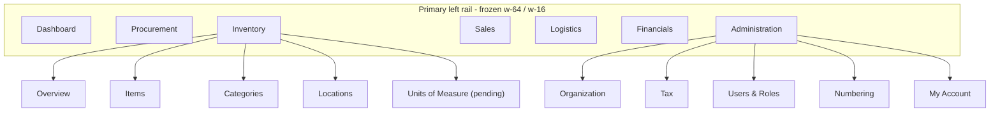
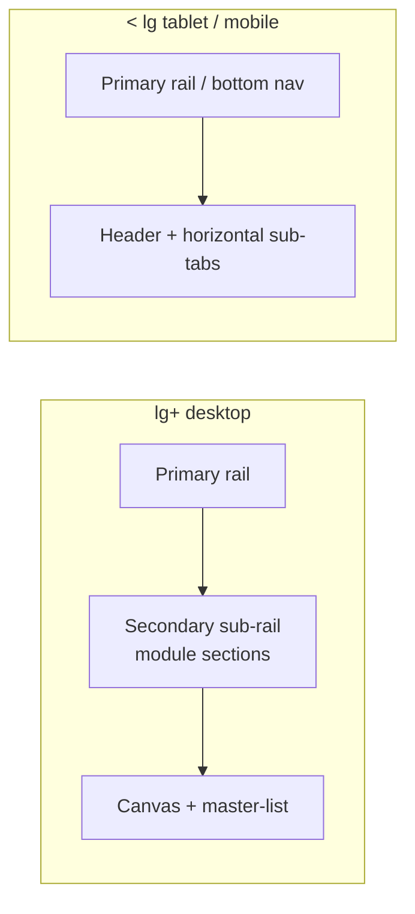

# AIB Smart ERP: Navigation & Information Architecture Specification

This document is the navigation/IA blueprint for the AIB workspace. The structure described here is
**implemented** (see §8 for per-phase status). It builds on the frozen layout primitives defined in
[DESIGN_SYSTEM.md](DESIGN_SYSTEM.md) (top strip, collapsible left rail, master-list/drawer/editor
patterns) and changes **information architecture and structure only** — the Items Master and
Organization Settings internal layouts stay frozen.

---

## 1. Current State (baseline)

| Area | Today | Source |
|------|-------|--------|
| Primary rail | 6 modules: Dashboard, Procurement, Inventory (Items/Categories/Locations), Sales, Logistics, Financials | [module-nav.tsx](../apps/web/components/layout/module-nav.tsx) |
| Built module pages | Only **Dashboard** and **Inventory** children have `page.tsx` | `apps/web/app/**` |
| Dead links | **Procurement, Sales, Logistics, Financials** have no page (404) | `apps/web/app` |
| Settings | Profile, Organization, Tax exist but are reachable only via avatar dropdown + omnibar; **Tax has no menu link at all** | [user-profile-actions.tsx](../apps/web/components/layout/user-profile-actions.tsx), [navigation-index.ts](../apps/web/lib/search/navigation-index.ts) |
| Secondary nav | Only Inventory has children; no consistent in-module nav | `module-nav.tsx` |
| Breadcrumbs / global create | None | — |
| Mobile | 6-item bottom bar + left module drawer | [mobile-bottom-nav.tsx](../apps/web/components/layout/mobile-bottom-nav.tsx), [mobile-nav-drawer.tsx](../apps/web/components/layout/mobile-nav-drawer.tsx) |

### Gaps vs global ERP conventions (Odoo, NetSuite, SAP Fiori, Dynamics 365, Zoho)

1. Nav advertises modules that do not exist (dead links).
2. No dedicated Administration/Settings hub; configuration is buried.
3. No consistent in-module secondary navigation.
4. No module landing/overview pages (Inventory deep-links straight to Items).
5. No breadcrumbs / location awareness.
6. No global "+ Create" quick action.

---

## 2. Target Information Architecture

### Module → section map

| Module | Root route | Sections | Status |
|--------|-----------|----------|--------|
| **Dashboard** | `/dashboard` | (single page) | Built |
| **Procurement** | `/procurement` | Overview, Purchase Orders, Suppliers, Bills | Coming soon |
| **Inventory** | `/inventory` | Overview, Items, Categories, Locations, Units of Measure | Built (UoM pending) |
| **Sales** | `/sales` | Overview, Orders, Customers, Channels | Coming soon |
| **Logistics** | `/logistics` | Overview, Shipments, Transfers | Coming soon |
| **Financials** | `/financials` | Overview, Chart of Accounts, Ledger, Tax Filings | Coming soon |
| **Administration** | `/settings` | Organization, Tax, Users & Roles, Numbering, My Account | Built (needs hub) |

Modules marked "Coming soon" render a **Coming-soon module shell** (overview page with greyed,
labeled sections) instead of 404ing. Built modules resolve their root to an **Overview** landing.

---

## 3. Responsive Secondary Navigation

One nav model, two responsive presentations (no new visual language — reuse existing components):

- **`lg+` (desktop): secondary sub-rail.** Between the primary rail and the canvas, using
  `lg:grid lg:grid-cols-[13rem_minmax(0,1fr)] lg:gap-6`. Reuse the shipped rail treatment: active
  `bg-secondary font-medium text-secondary-foreground`, inactive
  `text-muted-foreground hover:bg-muted/60 hover:text-foreground` (same as the editor / org-settings
  rail).
- **`< lg` (tablet/mobile): horizontal sub-tabs.** The sub-rail collapses into a sticky horizontal
  bar under the page header, reusing
  [section-scroll-chip-bar.tsx](../apps/web/components/layout/section-scroll-chip-bar.tsx) — the same
  component already used for in-form section nav. Active chip
  `border-primary text-foreground ring-1 ring-inset ring-primary`.
- The sub-nav lives inside `<main data-dashboard-scroll-root>` and must not introduce a nested scroll
  root (per DESIGN_SYSTEM §1.3).

---

## 4. Module Landing / Overview Pages

- Each module root (`/inventory`, `/procurement`, …) resolves to an **Overview**: KPI tiles +
  shortcut cards to sections + recent records.
- Built modules show live data; unbuilt modules show a Coming-soon overview listing planned sections
  (greyed) with a single descriptive empty-state block (per DESIGN_SYSTEM §8).
- Cards/tiles use `surface-panel`; section titles use the standard
  `text-sm font-semibold uppercase tracking-wide text-muted-foreground`.

---

## 5. Administration Hub

New `/settings` (Administration) becomes a first-class module with its own secondary sub-rail:

| Section | Route | Component (existing) |
|---------|-------|----------------------|
| Organization | `/settings/organization` | `OrganizationSettingsTerminal` (frozen) |
| **Tax** | `/settings/tax` | `TaxSettingsTerminal` (currently unlinked) |
| Users & Roles | `/settings/users` | new (RBAC schema exists) |
| Numbering | `/settings/numbering` | extract/relink from org settings numbering |
| My Account | `/settings/profile` | `ProfileSettingsTerminal` |

- This directly fixes "I can't see Tax Settings."
- Avatar dropdown is trimmed to **My Account**, **Switch Workspace** (when multi-tenant), and **Sign
  Out**; the configuration links move into the Administration rail
  ([user-profile-actions.tsx](../apps/web/components/layout/user-profile-actions.tsx)).
- The omnibar navigation index ([navigation-index.ts](../apps/web/lib/search/navigation-index.ts))
  is kept in sync with all new routes.

---

## 6. Breadcrumbs & Global Create

- **Breadcrumbs**: a row under the top strip on `md+` showing `Module › Section › Record`
  (e.g. `Inventory › Items › ACME-001`). Hidden on mobile to preserve vertical space. Rendered by the
  shell so every page inherits it.
- **Global "+ Create"**: a top-strip menu beside the omnibar
  ([top-utility-strip.tsx](../apps/web/components/layout/top-utility-strip.tsx)) offering
  context-aware shortcuts (New Item, New Category, New Location, …) using Lucide icons. This is the
  NetSuite/Dynamics quick-create pattern.

---

## 7. Mobile Reconciliation

- The 6-cell bottom bar cannot cleanly hold 7 destinations. Keep the **4–5 highest-frequency
  modules** as tabs plus a **"More" tab** that opens the existing module drawer
  ([mobile-nav-drawer.tsx](../apps/web/components/layout/mobile-nav-drawer.tsx)) containing the
  remaining modules + Administration.
- In-module section navigation on mobile uses the "More" drawer's expanded module group (no separate in-content section nav).
- Aligns with DESIGN_SYSTEM §2.1/§2.2 (bottom tab bar + "More" drawer).

---

## 8. Implementation Phases (status)

| Phase | Deliverable | Status | Key files |
|-------|-------------|--------|-----------|
| 1. Nav model | Section-per-module config + `comingSoon`/`mobilePrimary` flags + Administration entry | Done | [module-nav.tsx](../apps/web/components/layout/module-nav.tsx), [module-nav-active.ts](../apps/web/lib/layout/module-nav-active.ts) |
| 2. Secondary nav | Sections live in the left sidebar (expanded module group); no separate in-content section nav or title chrome | Done | [sidebar-nav.tsx](../apps/web/components/layout/sidebar-nav.tsx), [module-nav-active.ts](../apps/web/lib/layout/module-nav-active.ts) |
| 3. Administration hub | `/settings` overview + sub-rail; Tax/Org/Users/Profile linked; avatar dropdown trimmed; omnibar synced | Done | `app/settings/page.tsx`, `app/settings/users/page.tsx`, [user-profile-actions.tsx](../apps/web/components/layout/user-profile-actions.tsx), [navigation-index.ts](../apps/web/lib/search/navigation-index.ts) |
| 4. Module landings | Overview pages + Coming-soon shell | Done | `app/{inventory,procurement,sales,logistics,financials}/page.tsx`, [module-overview.tsx](../apps/web/components/layout/module-overview.tsx), [coming-soon-module.tsx](../apps/web/components/layout/coming-soon-module.tsx) |
| 5. Create | Global create menu in the top strip; each page renders its own title/subtitle + create action | Done | [global-create-menu.tsx](../apps/web/components/layout/global-create-menu.tsx), [top-utility-strip.tsx](../apps/web/components/layout/top-utility-strip.tsx) |
| 6. Mobile | Bottom-nav "More" tab + drawer Soon badges | Done | [mobile-bottom-nav.tsx](../apps/web/components/layout/mobile-bottom-nav.tsx), [mobile-nav-drawer.tsx](../apps/web/components/layout/mobile-nav-drawer.tsx) |
| 7. Docs sync | DESIGN_SYSTEM references this IA | Done | [DESIGN_SYSTEM.md](DESIGN_SYSTEM.md) |

### Implementation notes / deviations

- Numbering is configured inside Organization settings, so it is **not** a separate Administration
  route; the Administration overview notes this.
- Section navigation is handled entirely by the **left sidebar**: an active module expands to list
  its sections (Overview/Items/Categories/…) with the active one highlighted. There is no
  in-content section rail, tab strip, breadcrumb, or persistent module title — this saves vertical
  space and avoids duplicating the sidebar. Each page renders its own title/subtitle plus its
  create/New action on the right.
- Units of Measure and Users & Roles are surfaced as **Coming soon** (no dead links).

---

## 9. Constraints

- **Frozen layouts**: Items Master and Organization Settings internal list/drawer/editor structure is
  not changed; they only gain the surrounding secondary sub-rail and breadcrumb.
- **No new visual system**: reuse existing tokens, `SectionScrollChipBar`, rail active/inactive
  states, `surface-panel`, and Lucide icons only.
- **Single scroll root**: all content continues to scroll inside `<main data-dashboard-scroll-root>`;
  the secondary nav must not shadow it.
- **List modules**: every records-list section (Items, Categories, Locations, future Suppliers,
  Customers, Orders) follows the List Module Replication Checklist in DESIGN_SYSTEM §9.
